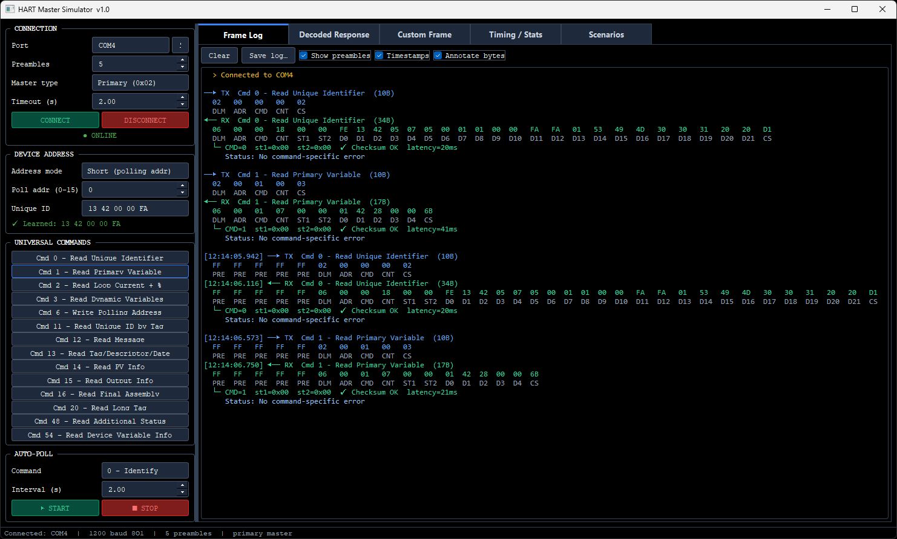
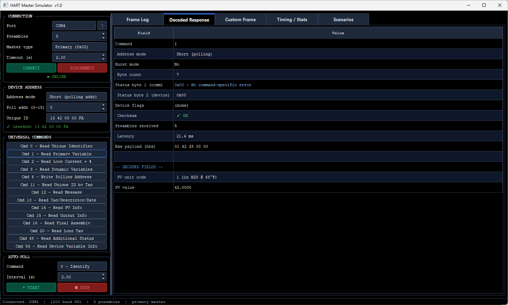
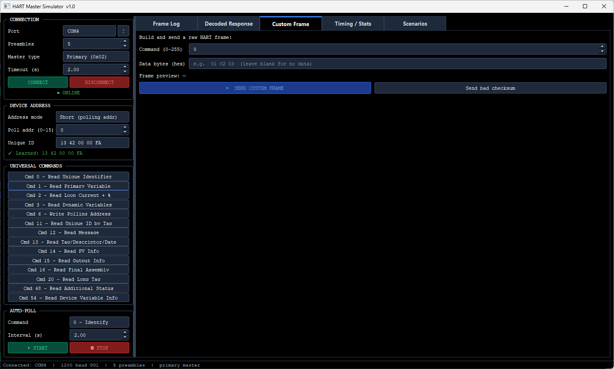
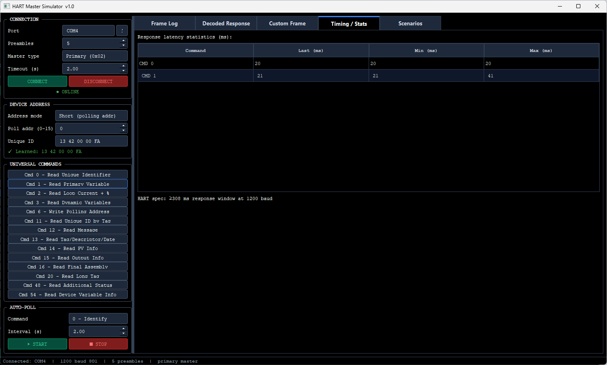
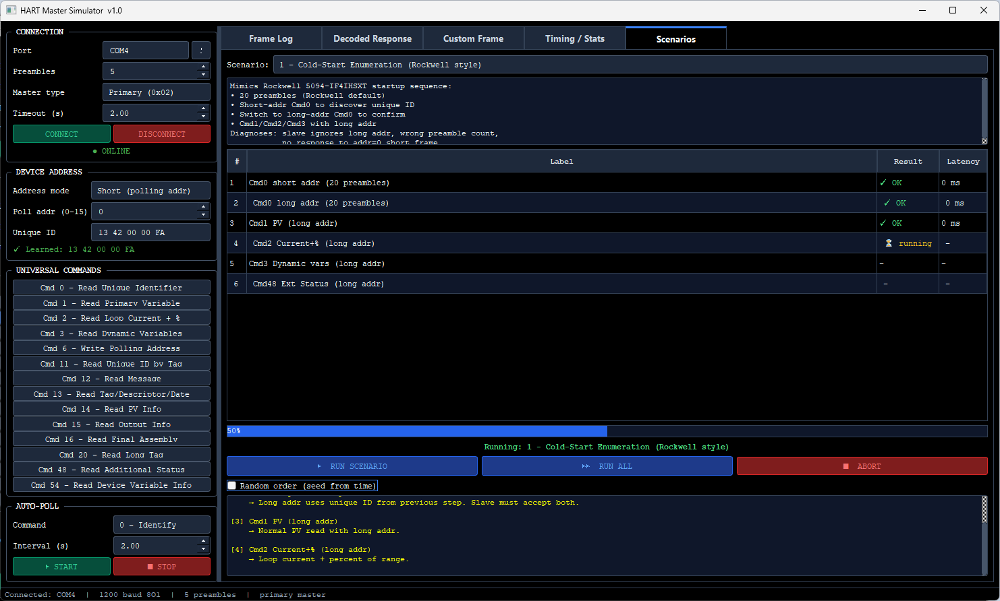
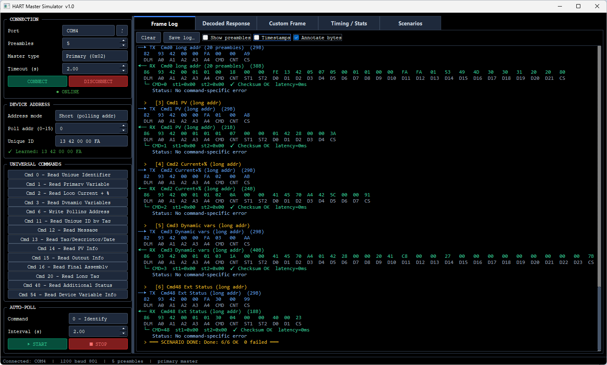

# HART Master Simulator

Diagnostic and simulation tool for testing HART slave devices and monitoring protocol exchange. Simulates master controller behaviors to validate field device conformity and physical layer compatibility.

## Features

- **Diagnostic Scenarios**: 16 pre-configured sequences ranging from standard cold-start enumeration to stress testing and invalid command injection.
- **Configurable Physical Layer Parameters**: Supports adjustable preamble counts, parity selection (`8O1`), and exact 1200 baud timing.
- **Dual-Master Simulation**: Toggle between primary master (`0x02`) and secondary master (`0x01`) roles.
- **Robust Address Validation**: Supports both short (polling address 0) and long (unique-ID) addressing schemes.
- **Custom UI Skinning**: Integrated QSS styling for dark-mode workspace execution.

## File Structure

- `hart_master_simulator.py`: Main PyQt5 application, serial interface worker thread, and GUI logic.
- `scenarios.py`: Dictionary definitions containing step-by-step diagnostic test routines.
- `style.qss`: StyleSheet providing unified dark theme across interface components.

## Requirements

```bash
pip install PyQt5 pyserial

```

## Usage

```bash
python hart_master_simulator.py

```

1. Select active COM port.
2. Connect.
3. Run Indiviual comands or Scenarious.
4. Analyze output and status.


## Screenshots

<b>Hart Master Simulator - Frame Log:</b>


<b>Hart Master Simulator - Decoded Response:</b>


<b>Hart Master Simulator - Custom Frame:</b>


<b>Hart Master Simulator - Timing Stats:</b>


<b>Hart Master Simulator - Scenarios:</b>


<b>Hart Master Simulator - Scenarios in Frame Log:</b>
